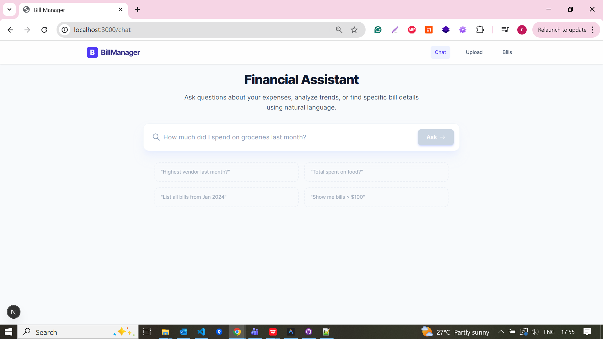
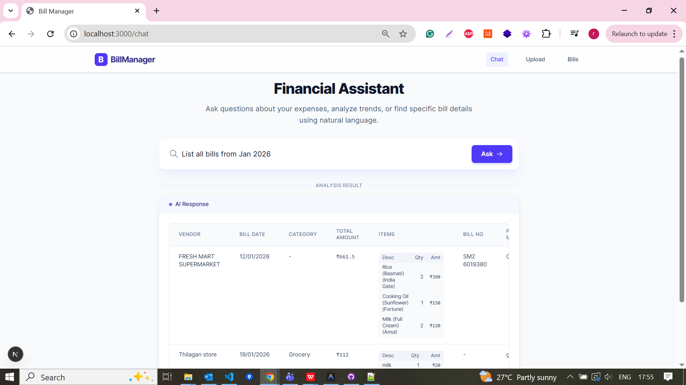
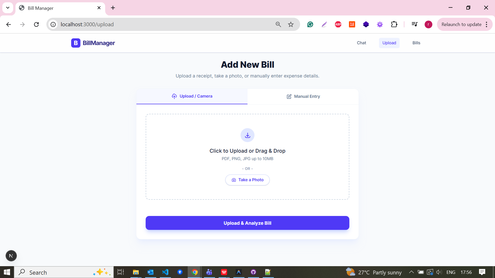
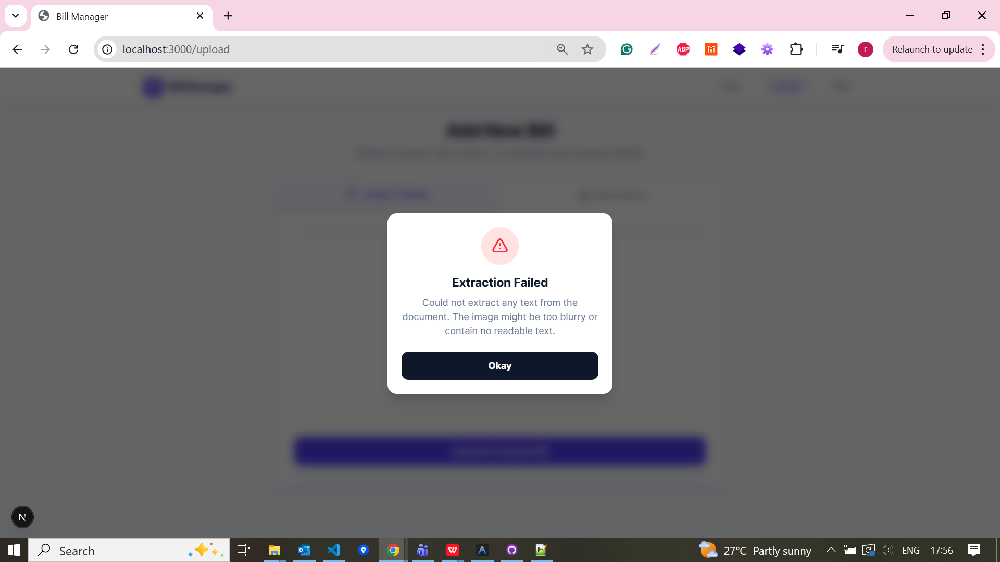
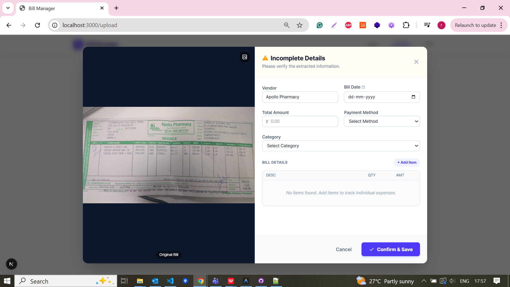
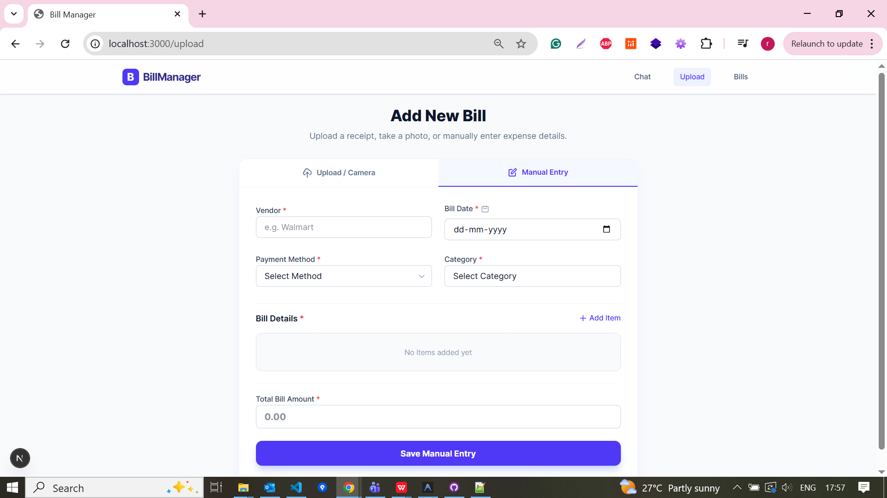
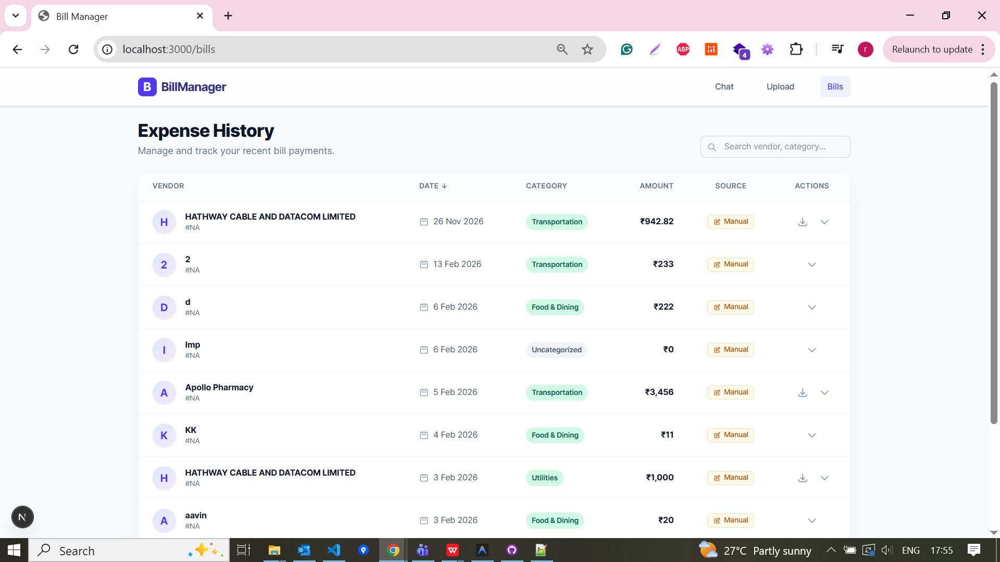

# Bill Management RAG System

A comprehensive bill management system powered by RAG (Retrieval-Augmented Generation) technology, combining MongoDB for structured data storage and Pinecone for intelligent semantic search. The system features OCR-based bill extraction, manual entry, and AI-powered querying capabilities.

## 🌟 Features

- **📄 Smart Bill Upload**: Upload bills via file upload or camera capture with automatic OCR extraction
- **✍️ Manual Entry**: Add bills manually with detailed line items
- **🔍 Intelligent Search**: Semantic search powered by vector embeddings and traditional MongoDB queries
- **💬 AI Chat Interface**: Query your bills using natural language (e.g., "Show all grocery bills from last month")
- **📊 Expense History**: View, sort, filter, and download your bills with pagination
- **✅ Validation & Preview**: Review extracted data before saving with inline validation
- **📱 Responsive Design**: Modern, mobile-friendly UI built with Next.js and Tailwind CSS

## 🏗️ Architecture

### Frontend
- **Framework**: Next.js 15 (React 19)
- **Styling**: Tailwind CSS
- **Language**: TypeScript
- **API Routes**: Next.js API routes for backend proxy

### Backend
- **Framework**: FastAPI (Python)
- **Database**: MongoDB (structured data)
- **Vector Store**: Pinecone (semantic search)
- **OCR**: Tesseract OCR + pdf2image
- **LLM**: Groq (via LangChain)
- **Embeddings**: Sentence Transformers

## 📋 Prerequisites

Before you begin, ensure you have the following installed:

- **Node.js** (v18 or higher)
- **Python** (v3.11 or higher)
- **MongoDB** (running locally or remote instance)
- **Tesseract OCR** ([Download here](https://github.com/tesseract-ocr/tesseract))
- **Poppler** (for PDF processing - [Download here](https://github.com/oschwartz10612/poppler-windows/releases/))

## 🚀 Installation & Setup

### 1. Clone the Repository

```bash
git clone <your-repository-url>
cd bill-management-rag-mongo
```

### 2. Environment Configuration

The repository includes a `dev.env` file as a template. **You must rename it to `.env` and update the values with your own credentials.**

```bash
# Rename dev.env to .env
cp dev.env .env  # On Linux/Mac
# OR
ren dev.env .env  # On Windows
```

#### Update `.env` with your configuration:

```env
# API Keys (REQUIRED - Get from respective platforms)
GROQ_API_KEY="your_groq_api_key_here"
PINECONE_API_KEY="your_pinecone_api_key_here"
PINECONE_REGION="us-east-1"  # Update based on your Pinecone index region

# MongoDB Configuration
MONGO_URI="mongodb://localhost:27017"  # Update if using remote MongoDB
MONGO_DB_NAME="bill_management"

# OCR Tools (Update paths based on your installation)
TESSERACT_CMD="C:/Program Files/Tesseract-OCR/tesseract.exe"  # Windows
# TESSERACT_CMD="/usr/bin/tesseract"  # Linux/Mac

POPPLER_PATH="D:/workout/poppler-0.68.0/bin"  # Windows - Update to your path
# POPPLER_PATH="/usr/bin"  # Linux/Mac
```

#### Where to get API Keys:

- **Groq API Key**: Sign up at [https://console.groq.com](https://console.groq.com)
- **Pinecone API Key**: Sign up at [https://www.pinecone.io](https://www.pinecone.io) and create an index

### 3. MongoDB Setup

#### Create Database and Collection

1. **Start MongoDB** (if running locally):
   ```bash
   mongod
   ```

2. **Connect to MongoDB** using MongoDB Compass or mongo shell:
   ```bash
   mongosh
   ```

3. **Create Database and Collection**:
   ```javascript
   use bill_management
   db.createCollection("bills")
   ```

4. **Create Indexes** (recommended for better performance):
   ```javascript
   db.bills.createIndex({ "user_id": 1 })
   db.bills.createIndex({ "bill_date": -1 })
   db.bills.createIndex({ "vendor": 1 })
   db.bills.createIndex({ "category": 1 })
   ```

### 4. Backend Setup

#### Option A: Using pip (Recommended)

```bash
# Navigate to project root
cd bill-management-rag-mongo

# Create virtual environment
python -m venv .venv

# Activate virtual environment
# On Windows:
.venv\Scripts\activate
# On Linux/Mac:
source .venv/bin/activate

# Install dependencies
pip install -r requirements.txt
```

#### Option B: Using uv (Faster alternative)

```bash
# Install uv if not already installed
pip install uv

# Install dependencies
uv pip install -r requirements.txt
```

### 5. Frontend Setup

```bash
# Navigate to frontend directory
cd frontend

# Install dependencies
npm install
```

## ▶️ Running the Application

### 1. Start the Backend Server

```bash
# From project root, ensure virtual environment is activated
cd backend

# Run FastAPI server
uvicorn main:app --reload --port 8000
```

The backend API will be available at `http://localhost:8000`

**API Documentation**: Visit `http://localhost:8000/docs` for interactive API documentation

### 2. Start the Frontend Development Server

```bash
# From project root, open a new terminal
cd frontend

# Run Next.js development server
npm run dev
```

The frontend will be available at `http://localhost:3000`

## 📱 Using the Application

### Upload Bills
1. Navigate to **Upload** page
2. Choose between:
   - **File Upload**: Drag & drop or select PDF/image files
   - **Camera Capture**: Take a photo of your bill
   - **Manual Entry**: Fill in bill details manually
3. Review extracted data in the confirmation modal
4. Edit any incorrect fields and save

### View Expense History
1. Navigate to **Bills** page
2. Use search to find specific bills
3. Sort by date, vendor, or amount
4. Click on a bill to expand and view line items
5. Download original bill files using the download icon

### Chat with Your Bills
1. Navigate to **Chat** page
2. Ask questions in natural language:
   - "Show all grocery bills from February 2026"
   - "What's my total spending on transportation?"
   - "List bills from Walmart over $50"

## 🛠️ Troubleshooting

### Common Issues

**1. Tesseract not found**
- Ensure Tesseract is installed and the path in `.env` is correct
- Test: `tesseract --version`

**2. Poppler not found**
- Download Poppler and update `POPPLER_PATH` in `.env`
- Ensure the path points to the `bin` directory

**3. MongoDB connection failed**
- Verify MongoDB is running: `mongosh`
- Check `MONGO_URI` in `.env`

**4. Pinecone errors**
- Verify API key is correct
- Ensure you've created an index in Pinecone dashboard
- Check region matches your index

**5. Port already in use**
- Backend: Change port in uvicorn command: `--port 8001`
- Frontend: Set in `package.json` or use `PORT=3001 npm run dev`

## 📂 Project Structure

```
bill-management-rag-mongo/
├── backend/
│   ├── main.py                 # FastAPI app entry point
│   ├── app.py                  # Query router and LLM logic
│   ├── services/               # Business logic
│   │   ├── ingest_service.py   # Bill ingestion handling
│   │   ├── upload_service.py   # File upload & OCR
│   │   └── bill_service.py     # MongoDB operations
│   ├── utils/                  # Utilities
│   │   └── ocr_utils.py        # OCR and text extraction
│   ├── templates/              # Query templates
│   ├── db/                     # Database connections
│   └── vector_store/           # Pinecone operations
├── frontend/
│   ├── app/
│   │   ├── page.tsx            # Home page
│   │   ├── upload/             # Bill upload page
│   │   ├── bills/              # Expense history
│   │   ├── chat/               # AI chat interface
│   │   └── api/                # Next.js API routes
│   ├── public/                 # Static assets
│   └── package.json
├── .env                        # Environment variables (create from dev.env)
├── requirements.txt            # Python dependencies
└── README.md                   # This file
```

## 🔒 Security Notes

- **Never commit `.env` file** to version control
- The repository includes `dev.env` as a template only
- Replace all API keys and sensitive data with your own
- Use environment-specific configurations for production

## 📧 Support

For issues or questions, please [create an issue](your-repo-url/issues) on GitHub.

## Demo







